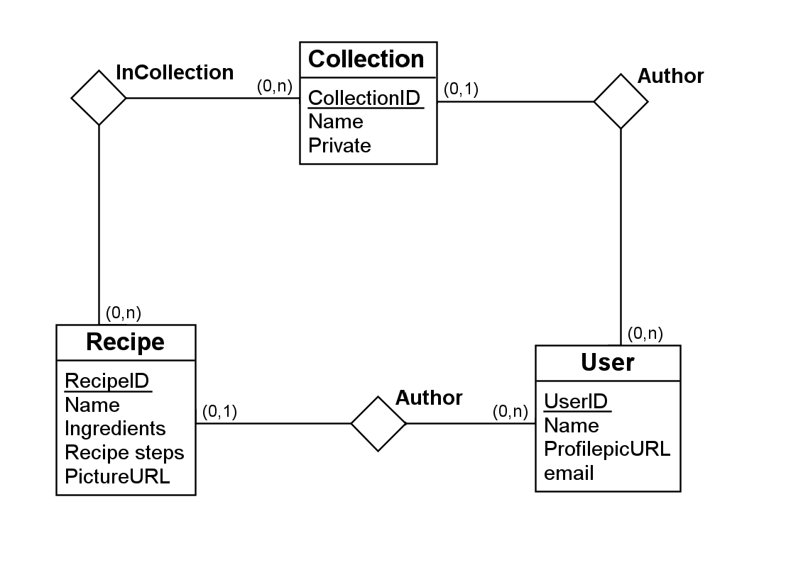

# Matnettside, working title: FeedMe

### Database ER-diagram

Som utgangspunkt samler vi alle oppskrifter i en mega-collection med navn 'Oppskrifter'
Vi kan videre lage vilkårlig antall samlinger og kategorier ved å opprette samlinger som refererer til 'OppskriftID' fra 'Oppskrifter'
Synligheten av disse bestemmes av en boolsk variabel som kan bruker for å velge om samlingen skal være offentlig tilgjenglig.
På denne måten kan vi bruke collection strukturen for å lage alt fra kategorier til favorittlister

