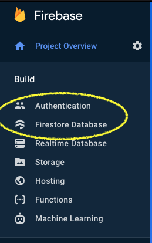
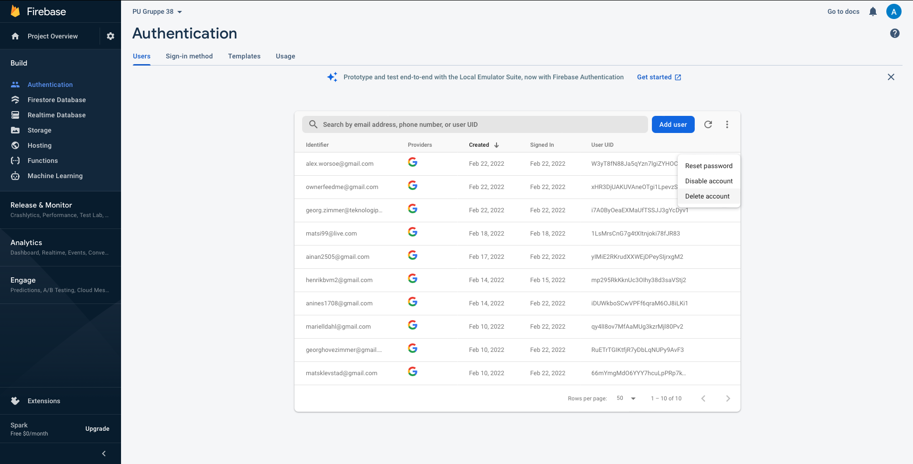
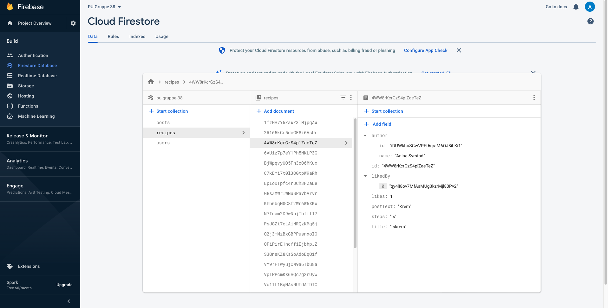
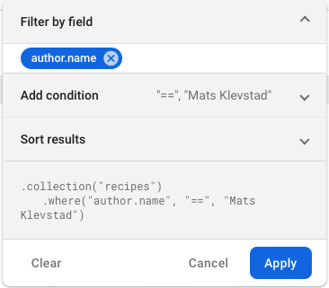
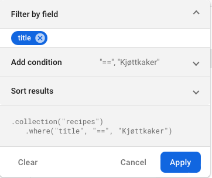
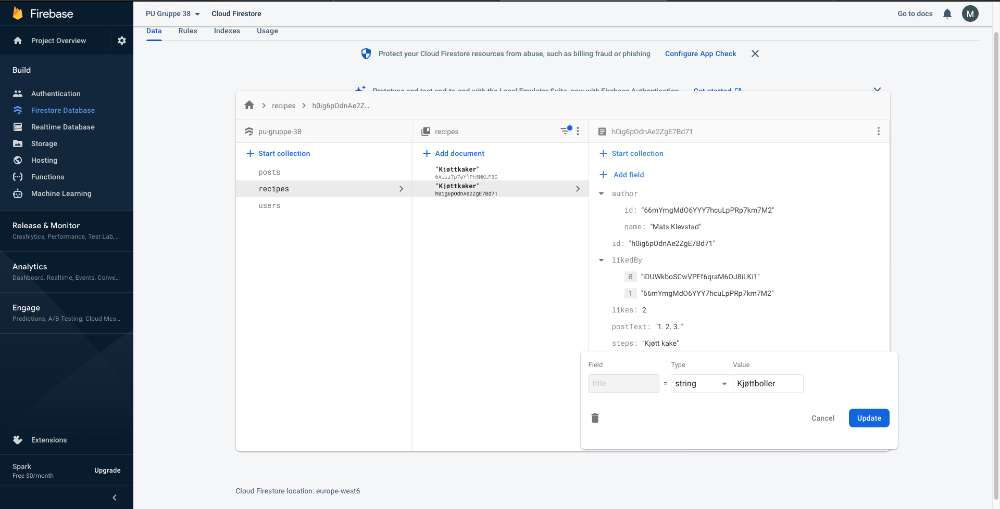
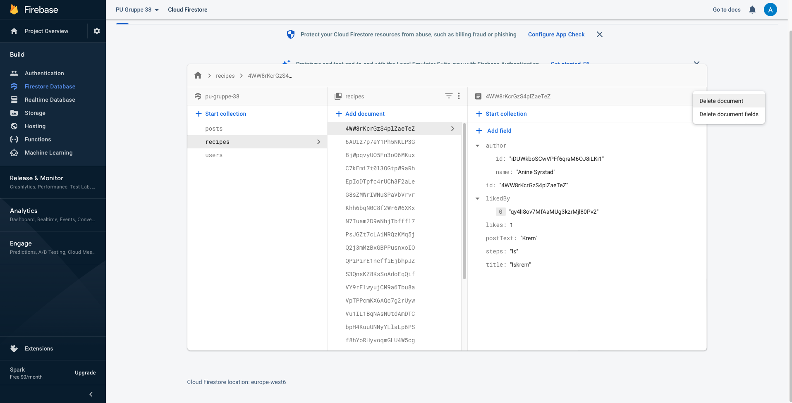

# 🍽️ Matnettside, working title: FeedMe

### ▶️ Kloning og kjøring av prosjekt

Prosjektet bygges og kjøres ved hjelp av npm, npm er altså en prerequisite for kjøring
Etter kloning av repo må det kjøres et par kommandoer i terminalen for å sikre feilfri kjøring.
Disse kommandoene er:

1. `cd feedme`
2. `npm install`
3. `npm i firebase`
4. `npm i react-router-dom`

Dersom dette gjennomføres korrekt kan prosjektet startes vha.:

`npm start`

og vil være tilgjenglig på `localhost:3000` hvis ingenting annet er spesifisert.

### 💾 Inspirasjon
Vi har hentet inspirasjon fra følgende repo: https://github.com/machadop1407/react-firebase-blog-website 

### 📖 Beskrivelse av ønsket produkt 
**Produktvisjon**: Gjøre deling av matoppskrifter så enkelt, informativt og effektivt som mulig.

**Beskrivelse**: Jeg står ofte i butikken uten å vite hva jeg skal lage til middag. Dette tror jeg er noe flere kjenner seg igjen i, og jeg ønsker derfor en løsning som kan hjelpe meg med oppskrifter både i hverdagen og til festligheter.

Jeg vil ha en strukturert plattform der man kan opprette, dele og lett finne frem til oppskrifter på matretter. Jeg vil ha persistent lagring av data på plattformen (Oppskrifter, brukere, o.l.). I tillegg hadde jeg satt pris på kategorisering av oppskrifter, samt muligheten for å rangere en rett jeg har prøvd.

For å sikre seriøse brukere ønsker jeg at man må logge seg inn med passord på egen bruker for å få tilgang til oppskriftene på applikasjonen (dere kan bestemme selv om dere vil lage en MVP uten innlogging for å komme raskt i gang med arbeidet). Hver bruker skal ha mulighet til å legge inn (og redigere) bilde, beskrivelse og andre elementer som skal være synlig for andre. Jeg ønsker også at oppskrifter er knyttet til brukerne som opprettet disse. Jeg ønsker også at eieren av plattformen skal kunne slette oppskrifter, og brukere som bryter retningslinjer.

Jeg har ikke bestemt om det skal være mobil-app eller nettside, men det er viktig med et bra design.

Til slutt hadde jeg satt pris på om dere kom på et catchy navn på tjenesten !

### 🔑 Endring av Firebase tilkobling

Prosjektet bruker database og backend hostet av Firebase, og kobles opp mot dette vha. `firebase-config.js` i `./feedme/src`.
Dersom du vil koble det opp mot en annen server må du endre `const firebaseConfig` til din egen servers api-nøkkel.

### 🗺️ Database ER-diagram

Som utgangspunkt samler vi alle oppskrifter i en mega-collection med navn 'Oppskrifter'
Vi kan videre lage vilkårlig antall samlinger og kategorier ved å opprette samlinger som refererer til 'OppskriftID' fra 'Oppskrifter'
Synligheten av disse bestemmes av en boolsk variabel som kan bruker for å velge om samlingen skal være offentlig tilgjenglig.
På denne måten kan vi bruke collection strukturen for å lage alt fra kategorier til favorittlister

### 👑 Hvordan bruke Firebase som adminbruker 

Start med å logge inn på [Firebase](https://console.firebase.google.com/u/0/) med utdelt admin-epostadresse og passord. Velg  prosjektet "PU Gruppe 38". 

Som admin skal man kun trenge å bry seg om de to markerte mulighetene: 

Under **Authentication** og "Users" får man opp følge skjermbilde: 
Her kan man se alle brukere som noensinne er logget inn i databasen.
Ved å trykke "disable account" på en bruker vil brukeren ikke kunne logge inn i nettsiden.
Ved å trykke "delete account" sletter man brukeren fra databasen, men oppskriftene vil fortsatt finnes i databasen. Brukeren vil kunne logge inn på nytt igjen dersom brukeren blir slettet, så "disable account" er å foretrekke hvis man skal hindre uønskede brukere tilgang. 

Under **Firestore Database** og "Data" finner man alle dataen lagret i databasen. 

Man kan enkelt sortere på ulike egenskaper i databasen ved å velge filter-ikonet. 

For å finne alle innleggene til en bestemt bruker kan man skrive "author.name", og legge til en "condition" om at dette skal være lik "Mats Klevstad". Da kommer alle innleggene til brukeren Mats Klevstad opp. Det er viktig å merke seg at søkefunksjonen er sensitiv på små og store bokstaver, så man må skrive akkurat det som er synlig på nettsiden. 

Eller så kan man f.eks. finne alle oppskrifter som heter "Kjøttkaker". 

Da blir resultatet slik:
Her kan man også klikke seg inn på en bestemt oppskrift og endrer attributter, som f.eks. nedenfor ved å endre tittelen til "Kjøttboller". Dette er mulig overalt i selve oppskrift-databasen, og alt man endrer på vil vises i nettsiden. 

For å slette oppskrifter trykker man på de tre prikkene til en oppskrift og trykker så på "Delete document". Da forsvinner oppskriften fra databasen og er ikke lenger synlig på nettsiden. 

**Mulighetene er veldig store og man kan filtere på masse ulikt. Skulle det være noen spørsmål er det bare å ta kontakt med oss!**

# feedme
# feedme
